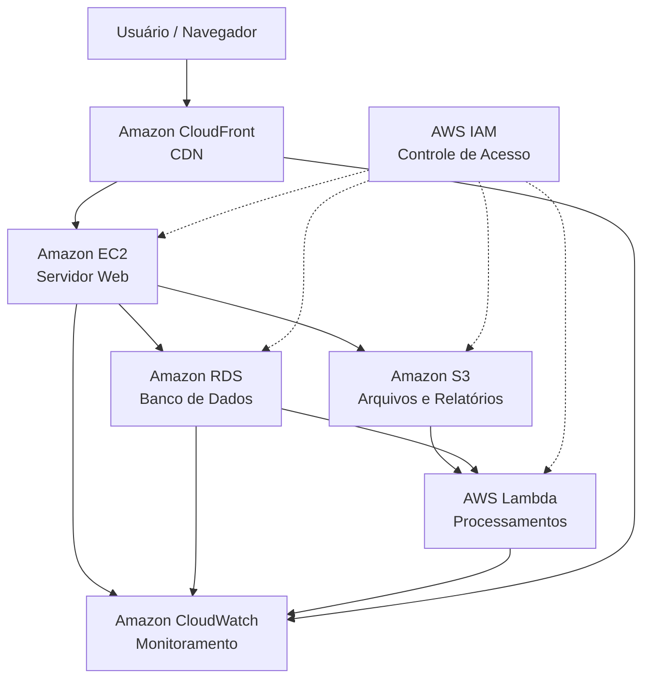

# 📌 Projeto de Arquitetura em Nuvem com AWS

Este projeto descreve uma arquitetura em nuvem baseada em serviços da **Amazon Web Services (AWS)**, organizada em etapas, com foco em **escalabilidade, segurança, performance e monitoramento**. O objetivo é demonstrar uma estrutura moderna e preparada para ambientes de produção.

---

## 🏗️ Visão Geral da Arquitetura

A solução foi dividida em **4 etapas principais**, cada uma utilizando serviços específicos da AWS para atender às necessidades do sistema.

A arquitetura atende a um cenário típico de aplicação web corporativa, com hospedagem de site, banco de dados, armazenamento de arquivos, processamento serverless e monitoramento contínuo.

---

## 🔹 Etapa 1 – Infraestrutura e Hospedagem

### Serviços Utilizados

* **Amazon EC2 (Elastic Compute Cloud)**
* **Amazon RDS (Relational Database Service)**

### Descrição

O **Amazon EC2** é responsável pela hospedagem do servidor web da aplicação, permitindo total controle sobre os recursos do sistema e escalabilidade sob demanda, conforme o volume de acessos.

O **Amazon RDS** hospeda o banco de dados relacional da aplicação, armazenando informações como clientes, pedidos e estoque. Ele oferece alta disponibilidade e backups automáticos.

### Benefícios

* Escalabilidade vertical e horizontal
* Alta disponibilidade
* Backup automático
* Baixo esforço de manutenção

---

## 🔹 Etapa 2 – Armazenamento e Segurança

### Serviços Utilizados

* **Amazon S3 (Simple Storage Service)**
* **AWS IAM (Identity and Access Management)**

### Descrição

O **Amazon S3** é utilizado para armazenamento de arquivos, relatórios e documentos da empresa, com alta durabilidade e custo reduzido.

O **AWS IAM** é responsável pelo controle de acesso aos recursos, garantindo que usuários e serviços tenham apenas as permissões necessárias, seguindo o princípio do menor privilégio.

### Benefícios

* Criptografia de dados (AES-256 ou KMS)
* Controle granular de permissões
* Versionamento de arquivos
* Conformidade com a LGPD

---

## 🔹 Etapa 3 – Escalabilidade, Performance e Custos

### Serviços Utilizados

* **Amazon CloudFront**
* **AWS Lambda**

### Descrição

O **Amazon CloudFront** atua como CDN, distribuindo o conteúdo com baixa latência e reduzindo a carga sobre os servidores EC2.

O **AWS Lambda** executa funções serverless para processamento de pedidos, envio de notificações (e-mail e SMS), integração com APIs externas e resposta a eventos do S3 e RDS.

### Benefícios

* Baixa latência
* Alta escalabilidade automática
* Redução de custos operacionais
* Integração nativa com serviços AWS

---

## 🔹 Etapa 4 – Monitoramento e Otimização

### Serviço Utilizado

* **Amazon CloudWatch**

### Descrição

O **Amazon CloudWatch** é responsável pelo monitoramento dos recursos da arquitetura, permitindo a criação de métricas, dashboards em tempo real e alarmes automáticos.

Ele também pode ser integrado ao Auto Scaling para ajustes automáticos de capacidade conforme a demanda do sistema.

### Benefícios

* Monitoramento em tempo real
* Detecção rápida de falhas
* Geração de relatórios de desempenho
* Otimização de custos

---

## 📊 Diagrama da Arquitetura (Mermaid)

O diagrama abaixo pode ser visualizado diretamente no **VS Code** utilizando suporte ao Mermaid:

---

## 🛠️ Tecnologias Utilizadas

* Amazon EC2
* Amazon RDS
* Amazon S3
* AWS IAM
* Amazon CloudFront
* AWS Lambda
* Amazon CloudWatch
* Mermaid Diagram

---

